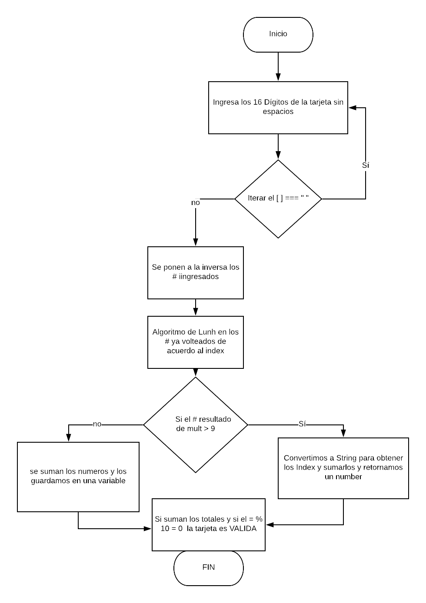

# TARJETA DE CRÉDITO VÁLIDA

## Descripción

Crea una web que pida, por medio de un prompt(), el número de una tarjeta de crédito y confirme su validez según el algoritmo de Luhn.

### Pseudocódigo

1- Crear documentación necesaria (html, JS, README).

2- En una variable *card* por medio de un prompt pedirle al usuario que ingrese los 16 digitos de su tarjeta de credito sin espacios.

3- Iterar para encontrar que no existan espacios.

4- Crearemos una función *isValidCard* donde mediante el algoritmo de Luhn comprobaremos si la tarjeta es válida.

#### Funcionalidad y Especificaciones

1- Prompt "Ingresa los 16 dígitos"

2- Por medio de un for iteraremos el array para encontrar espacios vacios si es así mandará un alert.

3- Crearemos la función isValidCard

4- Con una condicional donde si la suma de los numeros % 10 es igual a 0 la tarjeta será valida.

*Tu código debe estar compuesto por 1 función: isValidCard,
El usuario no debe poder ingresar un campo vacío*

### Diagrama de flujo

